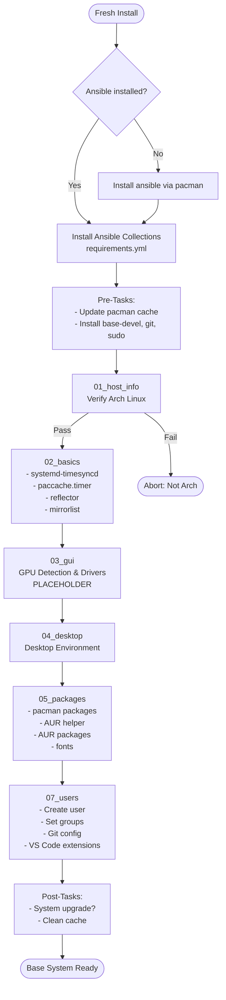

[defaults]
vault_password_file = /home/skogix/.ssh/ansible-vault-password
collections_path = ~/.ansible/.collections
fact_caching = community.general.yaml
fact_caching_connection = ~/.ansible/.cache
force_color = true
force_handlers = true
interpreter_python = python
inventory = .hosts
local_tmp = /tmp/.ansible
remote_tmp = /tmp/.ansible
roles_path = roles

[diff]
always = yes
vault_password_file = ~/.ssh/ansible-vault-pass
---
collections:
  - name: ansible.posix
    version: ">=1.5.0"
  - name: community.general
    version: ">=11.0.0"
  - name: kewlfft.aur
    version: ">=0.11.0"
---
# System Setup Flowchart

## Initial Bootstrap Flow (arch-base.yml)

## On-Demand Management Flow (site.yml)

## Variable Resolution Flow

## Maintenance Flow

---

collections/:
ansible_collections

docs/:
llm
regular

group_vars/:
all

playbooks/:
arch-base.yml
arch-maintenance.yml
install_requirements.yml
site.yml
templates

roles:
01_host_info
02_basics
03_gui
04_desktop
05_packages
07_users
dotfiles
git
packages
ssh
system
tmux

